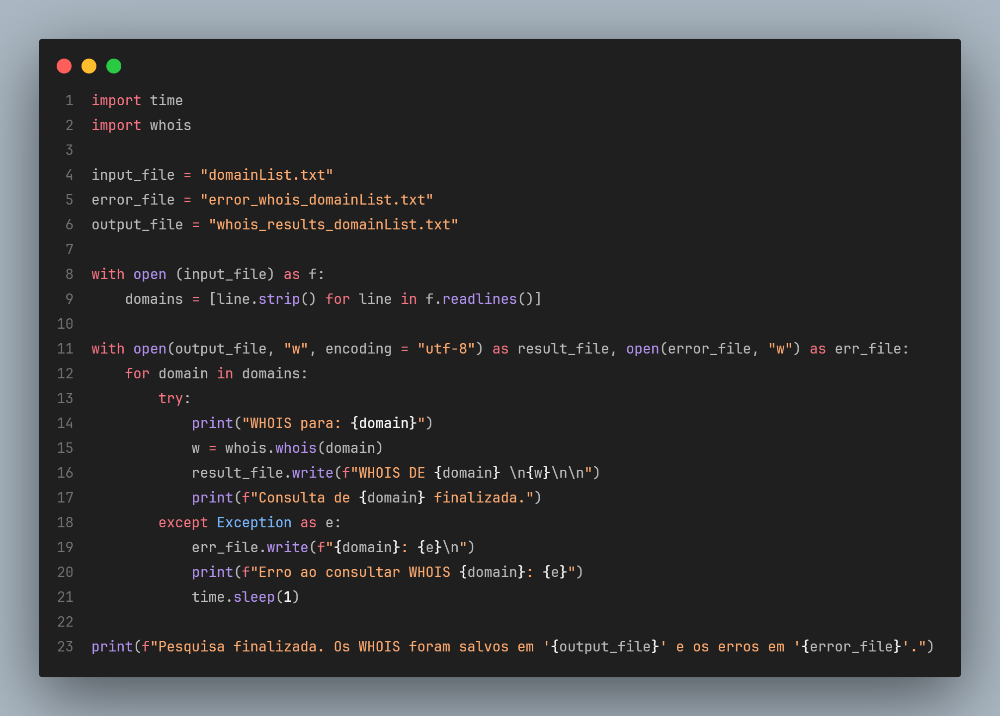
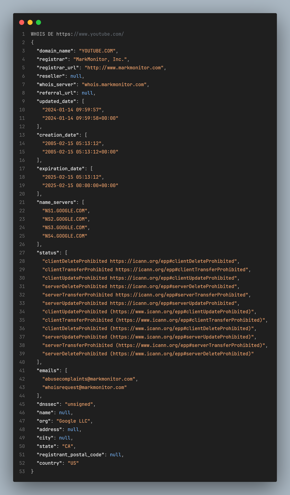
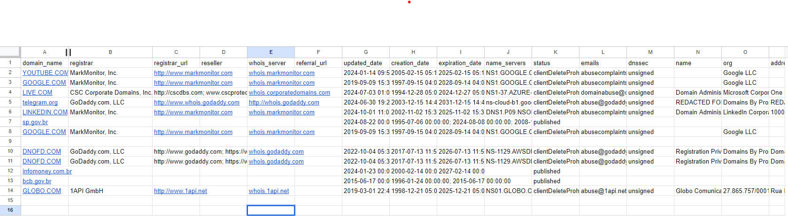

# 🔍 Script para pesquisa de registros WHOIS 

Desenvolvido em **Python**, o script consulta informações WHOIS para uma lista de domínios de um arquivo de texto, armazenando os resultados em um arquivo de saída e erros em outro. Ele lê os domínios, tenta realizar as consultas e registra os resultados ou erros, fazendo uma pausa de 1 segundo entre as tentativas. Ao final, exibe uma mensagem de conclusão com o status da pesquisa e o local onde os dados foram salvos.

## Como funciona?

Esse código realiza a consulta WHOIS para uma lista de domínios fornecida em um arquivo de texto (domainList.txt) e armazena os resultados em um arquivo de saída (whois_results_domainList.txt). O processo começa lendo os domínios do arquivo domainList.txt, onde cada domínio é armazenado em uma linha. Em seguida, dois arquivos são abertos: um para armazenar os resultados de consulta WHOIS (whois_results_domainList.txt) e outro para registrar erros (error_whois_domainList.txt).

Para cada domínio, o código tenta realizar a consulta WHOIS usando a biblioteca **python-whois**. Se a consulta for bem-sucedida, o resultado é gravado no arquivo de saída. Caso contrário, se houver algum erro, o domínio e a mensagem de erro são gravados no arquivo de erros, e o código faz uma pausa de 1 segundo antes de tentar o próximo domínio.

Ao final da execução, o código imprime uma mensagem de conclusão, informando que a pesquisa foi finalizada e os resultados foram salvos nos arquivos apropriados. 


## Tecnologias Utilizadas
- **Python**
- **Python-whois library**
- **Pandas library**
  
## Print do código



## Print do resultado 



## Print do código com a biblioteca pandas para exportação CSV


## Print do resultado CSV no Excel



## Como Rodar o Projeto

### Pré-requisitos
- **Python** instalado. <a href="https://www.python.org/downloads/" target="_blank">Baixe aqui.
- **Python-whois** instalado globalmente:  
- **Python pandas** instalado globalmente:
```bash
  pip install python-whois
  pip install pandas
```
1. Clone este repositório:
  ```bash
   git clone https://github.com/jonasmfernandes/whoisQuery.git
  ```
1. Acesse a pasta do projeto:
  ```bash
   cd whoisQuery
  ```
1. Vá ao arquivo main.py e execute, veja a lista de resultados ser gerada.

## Autor 
Desenvolvido por: Jonas Monteiro Fernandes